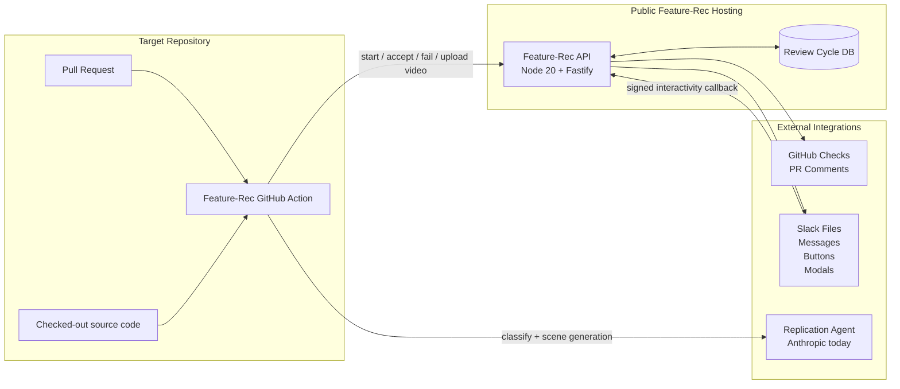
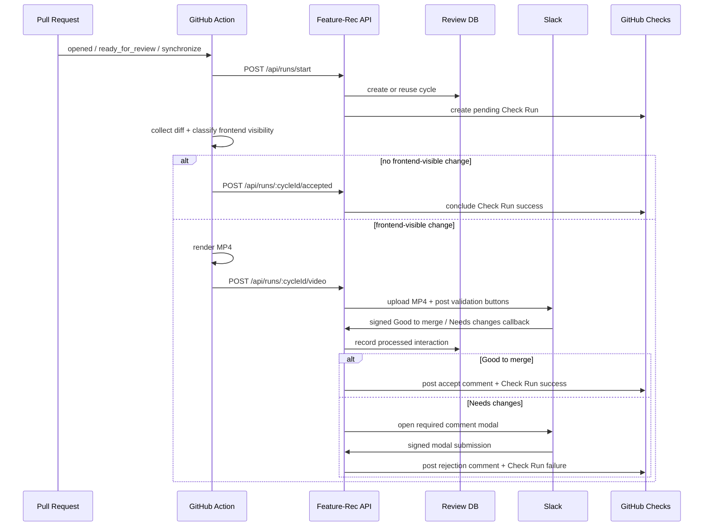
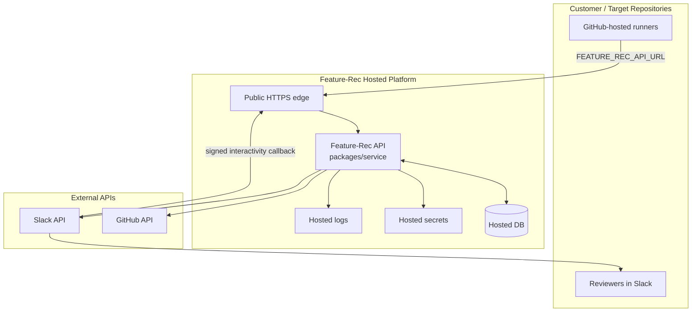
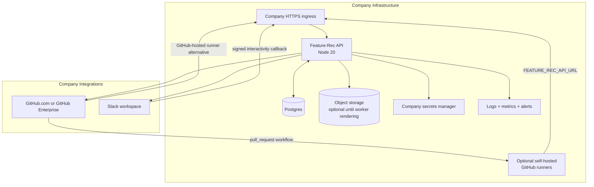
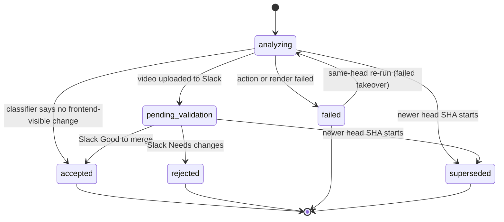
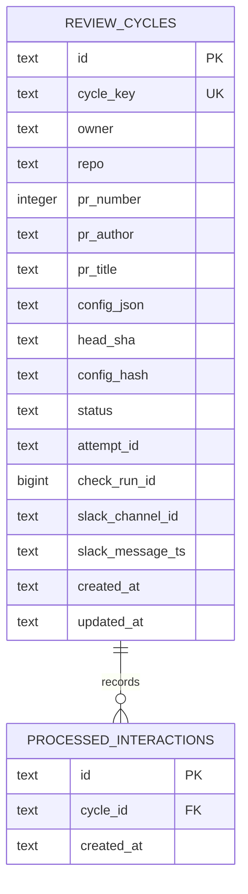

# Technical Architecture

Feature-Rec turns frontend-visible pull request changes into a Slack approval
flow. The product has two runtime surfaces:

- a GitHub Action that runs inside each target repository and decides whether a
  pull request needs product validation;
- a hosted Feature-Rec backend that owns review-cycle state, GitHub Checks,
  Slack uploads, and Slack approval callbacks.

AutoDemo is the current video-generation subsystem used by Feature-Rec. Today it
renders with Remotion. In the near-term architecture, Remotion should be treated
as an implementation detail behind a renderer boundary and replaced by internal
rendering code that consumes the same plan contract and produces the same MP4
artifact.

## Goals

- Keep source-code analysis and visual reproduction close to the target
  repository by running it in GitHub Actions.
- Keep long-lived integration state in a small hosted backend.
- Require an explicit Slack decision before GitHub branch protection can pass
  for frontend-visible product changes.
- Preserve a stable renderer contract so the Remotion implementation can be
  replaced without redesigning the GitHub, Slack, or storage flows.
- Avoid launching the target application for rendering; the renderer recreates
  only the relevant UI change from source and design tokens.

## Current System

```text
target repository
  pull_request event
    -> Feature-Rec GitHub Action
       -> load .github/feature-rec-config.yaml
       -> start review cycle in Feature-Rec backend
       -> collect PR diff and frontend source
       -> classify frontend visibility
       -> no frontend-visible change: accept Check Run
       -> frontend-visible change:
          -> reproduce changed UI as a generated scene
          -> render MP4
          -> upload MP4 to Feature-Rec backend

Feature-Rec backend
  -> stores review cycle
  -> creates and updates GitHub Check Run
  -> uploads video to Slack
  -> posts Slack validation message
  -> receives Slack button/modal callbacks
  -> writes PR comments and final Check Run result
```

### System Diagram



### Review Sequence



### Repository Modules

| Module | Role |
| --- | --- |
| `packages/action` | Composite GitHub Action entrypoint. It reads the PR event, loads config, starts a backend cycle, classifies the diff, invokes the renderer, and reports success/failure. |
| `packages/service` | Fastify backend for runner API endpoints, Slack interactivity, GitHub Checks, PR comments, Slack uploads, and persisted cycle state. |
| `packages/core` | Shared schemas and contracts for Feature-Rec config, cycle state, classifier output, Slack action payloads, and template rendering. |
| `packages/cli` | AutoDemo orchestration: finds UI changes, asks the replication agent to create scenes, builds a render plan, renders an MP4, and writes local artifacts. |
| `packages/video` | Current Remotion project, shared scene schema, generated scenes, visual components, and brand tokens. This is the main area to retire when the internal renderer is ready. |
| `fixtures` | Local before/after examples used for demos and offline renderer validation. |
| `examples` | Target-repository workflow and Feature-Rec config examples. |

## Runtime Responsibilities

### GitHub Action

The action runs on `pull_request` events for opened, ready-for-review, and
synchronize events. It is intentionally ephemeral and does not own durable state.

Responsibilities:

- install the monorepo action dependencies;
- read `.github/feature-rec-config.yaml`;
- call `POST /api/runs/start` with PR metadata and config hash;
- collect the full PR diff from the checked-out repository;
- classify whether the change is frontend-visible;
- auto-accept backend-only, docs-only, test-only, dependency-only, and CI-only
  changes;
- render a deterministic no-audio MP4 for frontend-visible changes;
- upload the MP4 to `POST /api/runs/:cycleId/video`;
- report failures to `POST /api/runs/:cycleId/failed`.

This split keeps target repository source code on the GitHub runner. The hosted
backend receives only PR metadata, the generated video, and approval decisions.

### Feature-Rec Backend

The backend is a public HTTPS service. It receives authenticated calls from the
GitHub Action and signed callbacks from Slack.

Responsibilities:

- create or reuse review cycles keyed by owner, repo, PR number, head SHA, and
  config hash;
- mark older active cycles for the same PR as superseded;
- create and update the configured GitHub Check Run;
- store cycle status, Slack message location, Check Run id, and processed Slack
  interaction ids;
- upload rendered MP4s to Slack and post validation buttons;
- validate Slack request signatures;
- enforce Slack approver usergroups when configured;
- handle `Good to merge` and `Needs changes` decisions;
- write configured PR comments and set final Check Run conclusions.

The current storage implementation is a Postgres-backed `CycleStore` using
Kysely and `pg`. Review-cycle state is safe for multi-instance service
deployments as long as all instances point at the same Postgres database.

### Renderer Pipeline

The current renderer pipeline is:

```text
FeatureRecSource[]
  -> read target Tailwind/global CSS tokens
  -> replication agent generates scene files
  -> build DemoPlan
  -> Remotion bundle/select composition/renderMedia
  -> out/demo.mp4
```

The renderer contract that should remain stable is:

```ts
type RenderInput = {
  repoRoot: string;
  sources: FeatureRecSource[];
  offline?: boolean;
};

type RenderOutput = {
  file: string;
  contentType: "video/mp4";
};
```

Internally, the renderer may continue to use `DemoPlan` as the intermediate
format:

```text
brand metadata
scene list
per-scene duration
scene props
```

The important boundary is that `packages/action` should ask for a video artifact,
not for a Remotion render. The rest of Feature-Rec should not care whether the
artifact came from Remotion, an internal frame renderer, a browser-capture engine,
or a server-side canvas/video encoder.

## Near-Term Remotion Replacement

Remotion should be retired in stages, not removed through a broad rewrite.

### Stage 1: Introduce a Renderer Interface

Create a renderer module in `packages/cli` that exposes one stable function,
for example `renderDemoVideo(plan): Promise<string>` or
`renderFeatureRecVideo(input): Promise<string>`.

Move the direct Remotion calls currently in `packages/cli/src/render.ts` behind
that interface. Keep the existing Remotion implementation as
`remotionRenderer`. Add an `internalRenderer` placeholder with the same output
contract once the internal implementation starts landing.

Expected result:

- `packages/action` continues to call `renderFeatureRecVideo`;
- `packages/cli` chooses the renderer implementation;
- `packages/service` remains unchanged;
- `packages/video` can be treated as a removable implementation package.

### Stage 2: Make Scene Generation Renderer-Neutral

The replication agent currently writes React/Remotion scene files. For the
internal renderer, it should generate renderer-neutral scene descriptions or
internal scene code instead.

Recommended target:

- keep `FeatureRecSource` as the source input;
- keep a plan object with brand, scene, timing, and asset metadata;
- replace Remotion-specific scene code with an internal scene AST or component
  API;
- validate generated output with schemas before rendering;
- keep offline fixtures for deterministic local validation.

### Stage 3: Implement Internal Rendering

The internal renderer should provide the capabilities Feature-Rec uses from
Remotion today:

- deterministic frame production;
- composition sizing, frame count, and FPS control;
- Tailwind/design-token interpretation or a project-token translation layer;
- text, layout, cursor, spotlight, caption, intro, outro, and screen-frame
  primitives;
- MP4/H.264 encoding with no audio track;
- progress reporting and clear render errors;
- local fixture rendering for self-tests.

The first internal version should match the existing visual output closely enough
for Slack validation. It does not need to reproduce every Remotion feature.

### Stage 4: Remove Remotion Package Surface

After parity tests pass:

- remove Remotion dependencies from `packages/video`;
- either delete `packages/video` or repurpose it as renderer-neutral visual
  primitives and schemas;
- update `pnpm studio` or replace it with an internal preview command;
- update docs and examples so the public product no longer references Remotion.

## Hosting Strategy

Feature-Rec supports two remote hosting strategies:

1. **Public hosted**: the Feature-Rec operator hosts the backend and target
   repositories connect to it over the public internet.
2. **Company self-hosted**: a customer company runs the backend inside its own
   cloud or infrastructure and operates the GitHub, Slack, storage, and secrets
   dependencies itself.

Local tunnel hosting is only for development.

### Shared Remote Requirements

Public endpoints:

| Endpoint | Caller | Purpose |
| --- | --- | --- |
| `GET /health` | hosting platform | Liveness/readiness check. |
| `POST /api/runs/start` | GitHub Action | Start or reuse a review cycle and create the Check Run. |
| `POST /api/runs/:cycleId/accepted` | GitHub Action | Mark a cycle accepted when no frontend-visible change is found. |
| `POST /api/runs/:cycleId/failed` | GitHub Action | Mark a cycle failed when classification or rendering fails. |
| `POST /api/runs/:cycleId/video` | GitHub Action | Upload the rendered MP4 for Slack validation. |
| `POST /api/slack/interactivity` | Slack | Receive signed button and modal callbacks. |

Network requirements:

- the service must have a stable public HTTPS URL;
- GitHub-hosted runners must be able to call the runner API endpoints;
- Slack must be able to call `/api/slack/interactivity`, unless the company
  later adds Slack Socket Mode;
- the service must be able to call GitHub and Slack APIs outbound;
- the database and any object storage must not be publicly reachable.

### Public Hosted Strategy

In the public hosted model, Feature-Rec is operated as a shared external service.
Target repositories configure `FEATURE_REC_API_URL` to the hosted API URL and
send only PR metadata, generated videos, and approval decisions to that service.



Recommended baseline:

- public HTTPS URL such as `https://feature-rec.example.com`;
- one or more Node 20 processes running `packages/service`;
- HTTPS termination at the platform edge or load balancer;
- managed Postgres for review-cycle state;
- object storage for transient videos if rendering moves from GitHub Actions to
  hosted workers;
- managed environment variables for secrets;
- health check on `GET /health`;
- central logs from stdout/stderr;
- firewall rules that expose only HTTPS;
- basic metrics for request failures, Slack callback failures, GitHub API
  failures, cycle status counts, and render duration.

Suitable platforms include Fly.io, Render, Railway, a small ECS service, GCP
Cloud Run with a managed database, Azure Container Apps, or a VM behind a load
balancer.

### Company Self-Hosted Strategy

In the company self-hosted model, the customer runs Feature-Rec in its own
infrastructure. The goal is not a heavy enterprise platform on day one; the
company needs enough components to operate the service reliably without a
developer laptop or temporary tunnel.



Minimum company-operated stack:

- a Node 20 deployment for `packages/service`;
- a stable HTTPS ingress URL reachable by GitHub runners and Slack callbacks;
- Postgres for review-cycle state;
- a secrets mechanism for GitHub App credentials, Slack credentials, and runner
  tokens;
- logs and basic alerts for failed requests, failed Slack callbacks, failed
  GitHub writes, and high renderer failure rate;
- backups for Postgres;
- a Slack App installed in the company workspace;
- a GitHub App installed in the company GitHub org or GitHub Enterprise Server;
- target repository variables and secrets for `FEATURE_REC_API_URL`,
  `FEATURE_REC_RUNNER_TOKEN`, and `ANTHROPIC_API_KEY` while the replication
  agent depends on Anthropic.

Recommended but not mandatory for the first self-hosted version:

- self-hosted GitHub runners if the company does not want PR source analysis to
  run on GitHub-hosted runners;
- object storage for generated MP4s if rendering is moved off the action runner;
- a small queue and renderer workers if render jobs become too slow or too
  expensive for GitHub Actions;
- deployment rollback through the company's normal release mechanism.

Public ingress is still needed for Slack interactivity unless the product later
adds Slack Socket Mode. If the company uses GitHub-hosted runners, those runners
also need network access to the Feature-Rec API. If the company uses self-hosted
runners inside its network, the runner endpoints can stay private, but the Slack
callback endpoint still needs a Slack-reachable path.

### Development Hosting

For local development only:

- run `pnpm feature-rec:service`;
- expose the service with ngrok or cloudflared;
- point `FEATURE_REC_API_URL` at the tunnel URL;
- configure Slack interactivity at
  `https://<host>/api/slack/interactivity`;
- point `DATABASE_URL` at a local or managed Postgres database.

This mode is useful for smoke testing but should not be treated as production
hosting. It depends on one developer machine being online and on a tunnel URL
that can change or expire.

Required environment variables:

| Variable | Purpose |
| --- | --- |
| `PORT` | HTTP port, default `3000`. |
| `FEATURE_REC_BASE_URL` | Public service URL used for externally visible callbacks and metadata. |
| `DATABASE_URL` | Postgres connection string used by the service. |
| `FEATURE_REC_RUNNER_TOKEN` | Shared bearer token used by GitHub Actions. |
| `GITHUB_APP_ID` | GitHub App id for Checks and PR comments. |
| `GITHUB_PRIVATE_KEY` | GitHub App private key. |
| `FEATURE_REC_GITHUB_TOKEN` | Local fallback token; avoid this in production. |
| `SLACK_BOT_TOKEN` | Slack bot token for file upload, messages, modals, and usergroups. |
| `SLACK_SIGNING_SECRET` | Slack request signature verification secret. |

Target repositories need:

- `FEATURE_REC_API_URL` repository variable;
- `FEATURE_REC_RUNNER_TOKEN` secret matching the backend;
- `ANTHROPIC_API_KEY` secret while the replication agent depends on Anthropic;
- `.github/feature-rec-config.yaml`;
- `.github/workflows/feature-rec.yml`;
- branch protection requiring the configured Check Run name.

## Schemas And Contracts

These schemas are the stable parts of the architecture. They are also the
boundaries that make the Remotion replacement low-risk: GitHub, Slack, storage,
and renderer contracts should not change just because the rendering engine
changes.

### Review Cycle State Schema



### Target Repository Config Schema

```yaml
version: 1

github:
  checkName: Feature-Rec
  mention: "@claude"
  acceptComment: "@{pr_author} validation passed; you can merge."
  rejectComment: "{mention} make the following changes:\n\n{review_comment}"

slack:
  channel: "C0123456789"
  mention: "<!subteam^S0123456789|@product-team>"
  approverUsergroups:
    - "S0123456789"
```

### Runner API Schema

```ts
type FeatureRecConfig = {
  version: 1;
  github: {
    checkName: string;
    mention: string;
    acceptComment: string;
    rejectComment: string;
  };
  slack: {
    channel: string;
    mention: string;
    approverUsergroups: string[];
  };
};

type RunStartRequest = {
  owner: string;
  repo: string;
  prNumber: number;
  prTitle: string;
  prAuthor: string;
  headSha: string;
  baseSha: string;
  configHash: string;
  checkName: string;
  config: FeatureRecConfig;
};

type RunStartResponse = {
  cycleId: string;
  cycleKey: string;
  checkRunId?: number;
  duplicate?: boolean;
  attemptId?: string;
};

type ClassifierResult = {
  frontendVisible: boolean;
  confidence: number;
  reason: string;
  userImpact: string;
  files: string[];
};

type SlackApprovalPayload = {
  action: "accept" | "request_changes";
  cycleId: string;
  headSha: string;
};
```

### Database Schema



### Renderer Schema

```ts
type FeatureRecSource = {
  id: string;
  file: string;
  before: string;
  after: string;
  prTitle: string;
  prNumber: number;
  caption: string;
};

type RenderInput = {
  repoRoot: string;
  sources: FeatureRecSource[];
  offline?: boolean;
};

type RenderOutput = {
  file: string;
  contentType: "video/mp4";
};

type DemoPlan = {
  brand: {
    productName: string;
    primary: string;
    tagline: string;
    releaseTag: string;
    prNumber: number;
  };
  scenes: Array<{
    id: string;
    title: string;
    durationInFrames: number;
    props: Record<string, unknown>;
  }>;
};
```

## Production Hardening

Before broad production use:

- move from a shared runner token to per-installation or per-repository runner
  credentials;
- rotate secrets through the hosting platform rather than committing them to
  files;
- add structured request ids across action logs, backend logs, Slack messages,
  and GitHub Check output;
- enforce upload size and duration limits at the renderer and backend boundary;
- retain only minimal cycle metadata and avoid storing video bytes after Slack
  upload;
- add database backups for Postgres;
- add metrics for cycle status counts, renderer failures, Slack callback
  failures, GitHub API failures, and render duration;
- add rate limiting for runner endpoints and Slack callbacks.

## Scale-Out Hosting

When review volume or render time grows, keep the backend lightweight and move
rendering into dedicated workers.

Future topology:

```text
GitHub Action
  -> start cycle
  -> upload source bundle or render request
  -> poll or receive render result

Feature-Rec API
  -> Postgres
  -> object storage for transient video artifacts
  -> queue

Renderer workers
  -> internal renderer
  -> write MP4 to object storage
  -> notify Feature-Rec API

Feature-Rec API
  -> Slack upload
  -> GitHub Check update
```

This topology should only be introduced when necessary. The current action-side
rendering has a useful privacy and simplicity advantage because the target
repository source remains on the GitHub runner.

## Security Model

- GitHub Actions authenticate to the backend with
  `FEATURE_REC_RUNNER_TOKEN`.
- Slack callbacks are verified with Slack's signing secret and timestamp.
- GitHub writes should use the GitHub App credentials, not a broad personal
  token.
- Slack approval can be restricted to configured Slack usergroups.
- Superseded cycles are detected by PR head SHA so stale Slack messages cannot
  approve an older commit.
- Runner result endpoints require the owning attempt id, so stale or duplicate
  runners cannot move the active cycle backward.
- Processed Slack interactions are stored idempotently to prevent duplicate
  approvals or duplicate rejection comments.

Recommended future improvements:

- replace the single runner token with scoped signed requests;
- include target repository identity in runner credentials;
- store audit events for approvals and rejections;
- add explicit retention policy for generated videos and render logs.

## Operational Runbook

Deploy backend:

1. Build and deploy `packages/service` on Node 20 or newer.
2. Set all production environment variables.
3. Confirm `GET /health` returns `{ "ok": true }`.
4. Configure the Slack app interactivity URL.
5. Configure the GitHub App installation on target repositories.
6. Add the Feature-Rec workflow and config to target repositories.
7. Require the configured Check Run in branch protection.

Validate one repository:

1. Open a docs-only PR and confirm the Check Run succeeds without Slack.
2. Open a frontend-visible PR and confirm a Slack message receives an MP4.
3. Click `Good to merge` and confirm the Check Run succeeds.
4. Open another frontend-visible PR, click `Needs changes`, submit a comment,
   and confirm the PR comment and failed Check Run.
5. Push a follow-up commit to an active PR and confirm the older Slack message is
   finalized as superseded.

## Migration Checklist

- Add renderer interface in `packages/cli`.
- Keep Remotion implementation behind the interface.
- Add internal renderer implementation behind the same interface.
- Add fixture parity tests that render the same feature through both paths.
- Add a config flag or environment variable to select the renderer during
  rollout.
- Run internal renderer in CI for fixtures.
- Switch Feature-Rec action default to the internal renderer.
- Remove Remotion dependencies and update docs once production validation passes.
